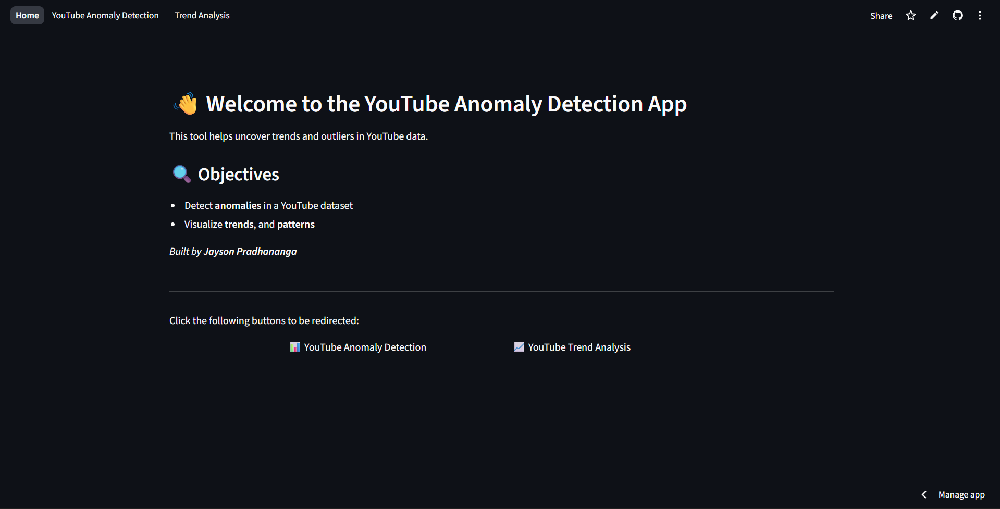
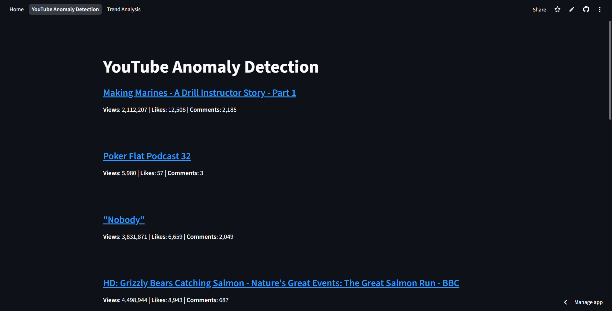
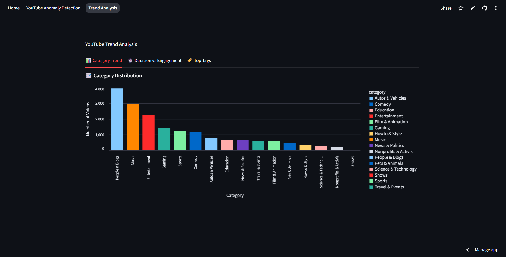

# 📊 YouTube Anomaly Detection and Trend Analysis App

This is a YouTube Anomaly Detection and Trend Analysis App made in Streamlit.  
🔗 [Live App](https://jayson-youtube-analysis.streamlit.app/)

---

## 🎯 Objective

- Anomaly Detection
- Analysis of trends:
  - Category Trends
  - Relation of duration and engagement
  - Top tags

---

## 🛠️ Tech Stack Used

1. Streamlit
2. Altair
3. scikit-learn
4. Pandas
5. Numpy
6. joblib
7. PyYAML

---

## 🧠 Models Used

1. Isolation Forest

---

## 📈 Evaluation Method

Since Isolation Forest is an Unsupervised Learning Algorithm, there are no ground truths.  
The model was evaluated qualitatively by inspecting flagged anomalies manually.

---

## 📚 Learnings from the Project

- Inference using saved pipeline
- DataFrame optimization

---

## 🖼️ Screenshots

  
  

---

## 🚀 Future Work

- Deploying the model with realtime YouTube API statistics
- Testing other unsupervised models for anomaly detection

---

## ✅ Conclusion

This project demonstrates how unsupervised learning can be applied to detect anomalies in YouTube video engagement using Isolation Forest. Through careful preprocessing and feature engineering, including the creation of an `engagement_score`, the app finds outliers using views, likes, comments, and duration. The dashboard enables intuitive exploration of anomalies and trends, laying the groundwork for future enhancements such as real-time data integration and model refinement.
